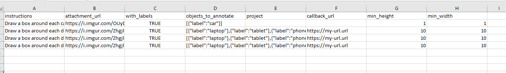

# Install and use it

[](https://actions-badge.atrox.dev/Rober19/sql-csv-insert-processor/goto?ref=master)

```
> npm i sql-csv-insert-processor
```

# Testing sql-csv-insert-processor

```ts
const SETUP: ProcessorSetup[] = [
  {
    result_file_name: 'exported/annotations/ann_box',
    laggards_file_name: 'exported/annotations/for_review_ann_box',
    fields: {
      attachment_url: 'image_url_address',
      instructions: 'details',
      with_labels: 'with_labels'
    },
    IS_INSERT_IGNORE: true,
    TABLE_NAME: 'ann_box',
    csv_file_path:
      './src/assets/Trainingset.ai - box annotation example - demo.csv',
    encoding: 'win1250',
    ON_DUPLICATED: '',
    PreProcessor: [
      /**
     * @param {*} data represents current row data
     * @param {requestCallback} PushToResult Run the function which save the row data into first result file
     * @param {requestCallback} PushToLaggards Run the function which save the row data into first result file
     */
      (data, callbackSaveResult, callbackSaveLaggards) => {
        // if (TABLE_NAME == '') {
        //   if (!isNumber(row.ampp_id)) {
        //     //
        //     PushToLaggards(`,( ${row_data.join(',')} )`);
        //   } else {
        //     PushToResult(`,( ${row_data.join(',')} )`);
        //   }
        // }
        // if (TABLE_NAME == 't_producto_ampp') {
        //   if (!isNumber(row.ampp_id) || !isNumber(row.t_producto_id)) {
        //     //
        //     PushToLaggards(`,( ${row_data.join(',')} )`);
        //   } else {
        //     PushToResult(`,( ${row_data.join(',')} )`);
        //   }
        // }

        console.log(data);

        callbackSaveResult();

        return data;
      }
    ]
  },
...
]
```

convert



into this

```sql
INSERT IGNORE INTO ann_box (details,image_url_address,with_labels) VALUES ( "Draw a box around each car","https://i.imgur.com/OUyDzS2.jpg","TRUE" )
( "Draw a box around each car","https://i.imgur.com/OUyDzS2.jpg","TRUE" )
,( "Draw a box around each device 2","https://i.imgur.com/ZhgjlpU.jpg","TRUE" )
,( "Draw a box around each device 3","https://i.imgur.com/ZhgjlpU.jpg","TRUE" )
,( "Draw a box around each device 4","https://i.imgur.com/ZhgjlpU.jpg","TRUE" )

```
