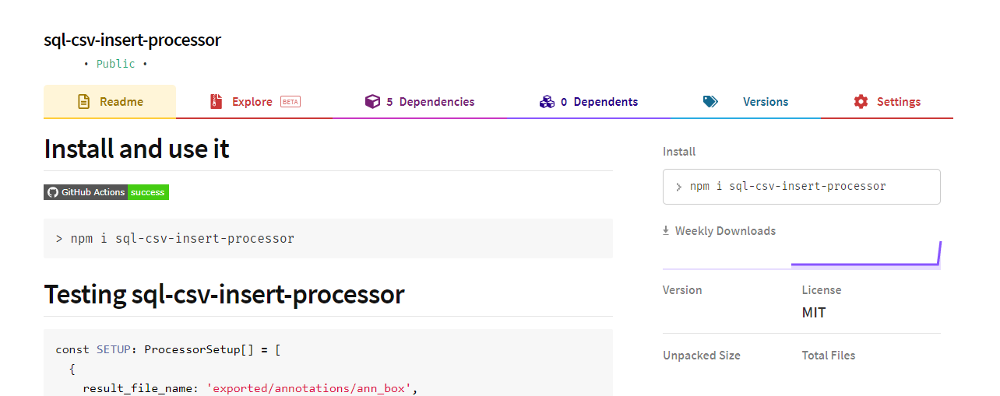

# Install and use it

[](https://actions-badge.atrox.dev/Rober19/sql-csv-insert-processor/goto?ref=master)

```
> npm i sql-csv-insert-processor
```

Go to [publication npm](https://www.npmjs.com/package/sql-csv-insert-processor)


